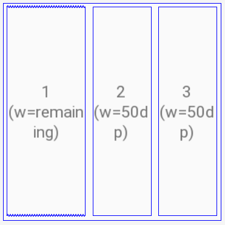
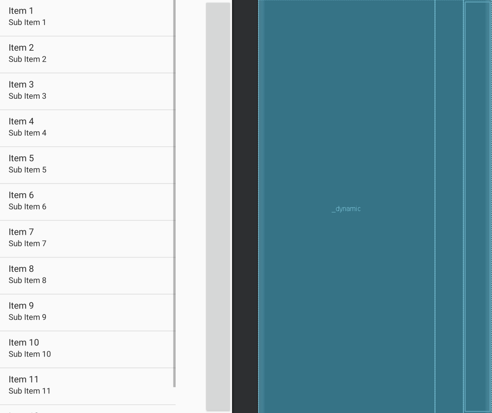
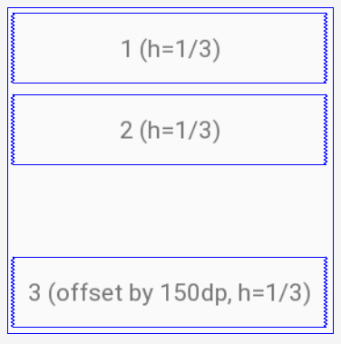
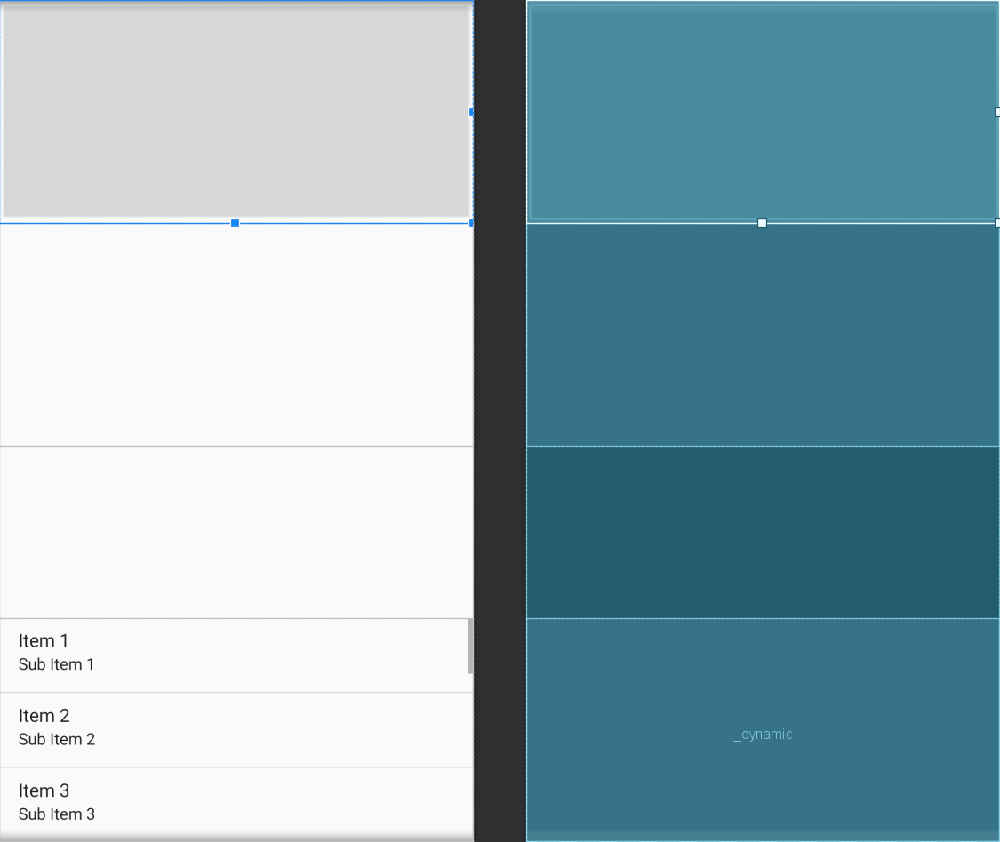
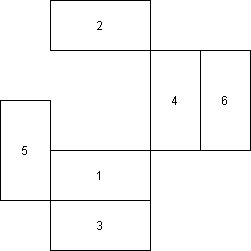
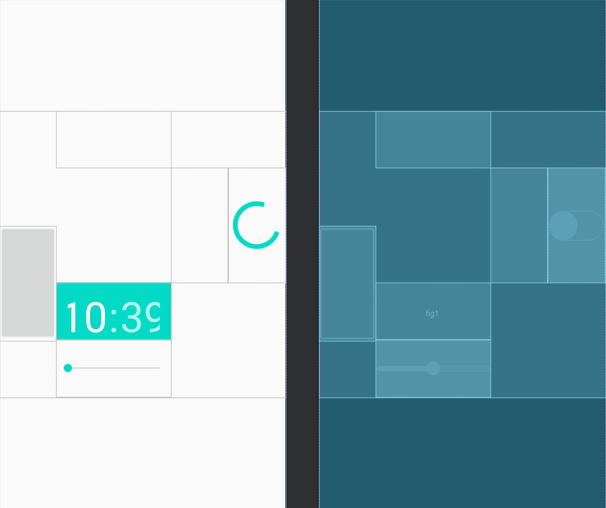

# Введение
В данной лабораторной работе предлагалось ознакомиться с IDE Android Studio и на основе индивидуальных вариантов заданий освоить использование таких Viewgroup-элементов, как LinearLayout и ConstraintLayout, а также свойства расположения элементов внутри них.

# 1. LinearLayout
### Задание №1

*Рис. 1. Задание 1*

Внутри LinearLayout следует разместить 3 любых виджета так, как это показано на рисунке 1. 
Для Layout задаем свойство `android:orientation="horizontal"` для того, чтобы элементы внутри него последовательно заполнялись по горизонтали. Для 2го и 3го View-элементов внутри Layout применяем свойство `android:layout_width="50dp"` для задания фиксированной ширины (как указано в задании). Для того, чтобы 1й элемент заполнил все оставшееся пространство своего родительского ViewGroup, следует задать ему вес, отличный от нуля, при помощи свойства `android:layout_weight="1"` (ширину элемента при этом можно указать любой). 

*Рис. 2. Реализация 1 задания*

### Задание №2

*Рис. 3. Задание 2*

Аналогично предыдущему заданию, располагаем случайные виджеты внутри LinearLayout. В отличии от первого заданий, в свойствах Layout было указано вертикальное расположение элементов (`android:orientation="vertical"`), а в самих виджетах работа велась не над шириной, а над высотой. Чтобы виджеты равномерно занимали данное им пространство, им нужно задать одинаковыен веса `android:layout_weight="1"`. У 3го виджету было также задан отступ сверху при помощи свойства `android:layout_marginTop="150dp"`.

*Рис. 4. Реализация 2 задания*

# 2. ConstraintLayout
### Задание №1
Задание абсолютно идентично 1му задании из части с LinearLayout. 
Все еще нужно задать фиксированую ширину для 2го и 3го элементов. Отличие реализации заключается в следующем:
- в Layout не нужно задавать направление, в котором будут расположены элементы;
- для 1го элемента не задается вес.

Вместо всего этого связываем элементы друг c другом при помощи constraints. Нам достаточно указать по одному constraint по вертикали и горизонатли для 2го и 3го элементов (все элементы связываем сверху с верхней границей родительского Layout при помощи свойства `app:layout_constraintTop_toTopOf="parent"`, 3й элемен справа связываем с правой границей родителя, 2й элемент аналогично с 3м). 1й элемент слева связываем с родителем, а справа - со 2м элементом, при этом важно указать ширину равной `0dp`, таким образом 1й элемент займет все незанятое в Layout пространство. Все элементы были заранее проидентефицированы, чтобы через constrait можно было указывать на их id.

### Задание №2
Задание абсолютно идентично 2му задании из части с LinearLayout. Более того, его можно выполнить за несколько мгновений при помощи инструментов самой IDE: в Android Studio есть функция конвертирования LinearLayout в ConstraintLayout. Полученный результат был абсолютно идентичен реализации этого же задания для LinearLayout.

### Задание №3

*Рис. 5. Задание 3*

В данном задании виджетам 1-3 было задано соотношение сторон 2:1 (`app:layout_constraintDimensionRatio="2:1"`), а виджетам 4-6 -- 1:2 (аналогичное свойство). После этого виджеты было легко привязать к сторонам других виджетов (были связаны грани, лежащие на одной прямой, и грани, граничащие с "родителем").

*Рис. 6. Реализация 3 задания*

# Вывод
В данной лабораторной работе произошло знакомство с IDE Android Studio, и такими понятиями, как View и ViewGroup. Также на практике были закреплены навыки задания свойств для размещения виджетов внутри LinearLayout и ConstraintLayout.