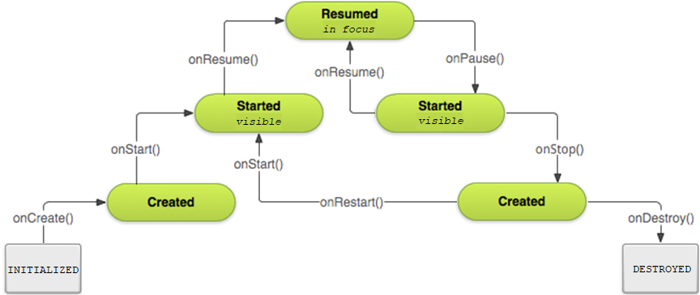

# Введение
В данной лабораторной работе предлагалось 
* Ознакомиться с жизненным циклом Activity
* Изучить основные возможности и свойства alternative resources

# Задание №1



*Рис. 1. Жизненный цикл Activity*

Для удобства отслеживания стадий жизненногоцикла моей Activity, допишем для функций, соответствующих 
стадиям цикла, вывод в Logcat (`Log.println(Log.DEBUG, "lifecycleLog", "<nameOfState>")`).

Для начала рассмотрел простые случаи, типа

Открытие приложения: CREATE > START > RESUME
Кнопки Home и Overview: PAUSE > STOP
Завершение процесса при помощи Overview: DESTROY
Поворот экрана на 90 градусов: PAUSE > STOP > DESTROY > CREATE > START > RESUME
Увеличение громкости:
Открытие верхней панели:

Решил проверить, что будет, если повернуть устройство в горизонтальное положение, а затем на 180 
градусов. Оказалось, что приложение поворачивается, только с жизненным циклом ничего не происходит.
Результат скучный, но весьма информативный.

Если выйти переключиться на другое приложение, повернуть экран и вернуться обратно в наше приложение, 
то произойдет следующее:

PAUSE > STOP > DESTROY > CREATE > START > RESUME

То есть произошло то же самое, что и при обычном повороте экрана.

Далее хотелось проверить, что будет если переключиться на другое приложение, повернуть в нем экран,
а затем переключиться на мое приложение (для этого вызвал ассистента Google при помощи зажатия 
кнопки home).

При вызове ассистента Google (зажатие кнопки Home), цикл переходит в состояние Pause. Если нажать 
кнопку Назад, приложение в логах увидим, что приложение продолжило работу (вызов OnResume()). А если 
нажать кнопку Home или Overview, то произойдет переход в состояние Stop. 

Заметил также, что спустя какое-то время (5-10 секунд бездействия или нажатие кнопки в ассистенте), 
ассистент переходит в "полноценный режим" как отдельное прилолжение (до этого ассистента не было в 
списке overview), тем самым переводя наше приложение в STOP.

Попробовал последовательно следующее:
1. Вызвать ассистента: PAUSE
2. Повернуть экран: STOP > DESTROY > CREATE > START > RESUME > PAUSE (тут повернулись и приложение,
и ассистент поверх него)
3. Вернуться обратно: RESUME

При этом если делать тоже самое при повороте горизонатльного экрана на 180 градусов, то приложение 
перевернется, но цикл будет выглядеть весьма коротко: PAUSE > RESUME.

Из этого можно сделать вывод, что в состоянии паузы работают некоторые базовые функции (как минимум
поворот экрана). 

# Задание №2

Альтернативный ресурс Screen aspect используется для адаптивной разработки приложения для устройств
с разными форматами экранов. Таким образом можно задавать различные ресурсы в зависимости от 
соотношения сторон.

/res/drawable-long/pic(5:3).png
/res/drawable-notlong/pic(4:3).png

Данная структура позволяет выбрать для экранов формата, например, 5:3 реесурс в drawable-long, а для 
формата 4:3 ресурс в drawable-notlong. Гораздо приятнее, когда ты сам можешь обрезать или увеличить 
изображение, а не ждать случайных результатов на разных устройствах.

# Задание №3
Заданы следующие конфигурации:

```
Конфигурация устройства:
LOCALE_LANG: en
LOCALE_REGION: rUS
SCREEN_SIZE: xlarge
SCREEN_ASPECT: long
ROUND_SCREEN: round
ORIENTATION: port
UI_MODE: television
NIGHT_MODE: night
PIXEL_DENSITY: mdpi
TOUCH: finger
PRIMARY_INPUT: nokeys
NAV_KEYS: dpad
PLATFORM_VER: v27

Конфигурация ресурсов:
(default)
en-port-watch-v27
en-long-land-car
normal-round-watch-night-notouch-v27
xlarge-round-v25
xlarge
fr-notround-land-desk-notouch-dpad
notouch-qwerty
xlarge-long-watch-nokeys
tvdpi-v25
rUS-notround-xxhdpi-12key-dpad
```

Сначала исключим из списка альтернатив все ресурсы, противоречащие заданной конфигурации устройства.
Кроме того нужно помнить исключения:
- использование квалификатора  SCREEN_SIZE  не подразумевает, что ресурсы предназначены только для 
экранов этого размера. Если не предусмотрены альтернативные ресурсы с квалификаторами, лучше 
подходящими к текущей конфигурации устройства, система может использовать любые наиболее подходящие 
ресурсы;
- тоже самое с квалификаторами PIXEL_DENSITY.

```
en-port-watch-v27                       // Противоречит UI_MODE
en-long-land-car                        // Противоречит ORIENTATION
normal-round-watch-night-notouch-v27    // Помним исключение про SCREEN_SIZE
xlarge-round-v25                        // Противоречит PLATFORM_VER
xlarge                                  
fr-notround-land-desk-notouch-dpad      // Противоречит LOCALE_LANG
notouch-qwerty                          // Противоречит TOUCH
xlarge-long-watch-nokeys                // Противоречит UI_MODE
tvdpi-v25                               // Помним исключение про PIXEL_DENSITY
rUS-notround-xxhdpi-12key-dpad          // Противоречит ROUND_SCREEN
```

Таким образом остались ресурсы `normal-round-watch-night-notouch-v27`, `xlarge` и 
`tvdpi-v25`. Из них к конфигурации устройства больше всего подходит `xlarge`, он и будет 
использоваться.

# Задание №4
Оказалось, что приложение
1. сбрасывает счетчик при разрушении его жизненного цикла (например при повороте);
2. продолжает считать в свернутом состоянии;
3. IDE ругает за layout для горизонтального положения (нет constraints, оно работает, но это вроде 
как дурной тон).

1 и 2 пункты решаются переписыванием функций `onStart` и `onStop`, чтобы при остановке усыплялся
трэд `uiUpdater`, подсчитывающий секунды, при этом сохраняя состояние при помощи callback-метода 
`onSaveInstanceState`, а при старте возобновлять трэд, восстанавливая состояние перед остановкой.

В 3 пункте просто добавить constraints.

# Вывод
В данной лабораторной работе произошло знакомство с жизненным циклом приложения в Android, а также
с ресурсами.